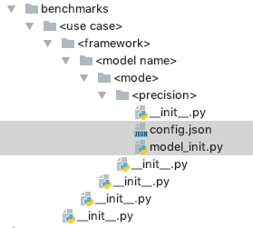
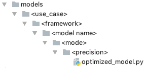
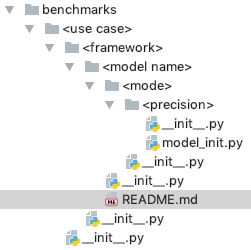

# Contributing to the Model Zoo for Intel® Architecture

## Adding scripts for a new TensorFlow model

### Code updates

In order to add a new model to the zoo, there are a few things that are
required:

1. Setup the directory structure to allow the
   [launch script](/docs/general/tensorflow/LaunchBenchmark.md) to find
   your model. This involves creating folders for:
   `/benchmarks/<use case>/<framework>/<model name>/<mode>/<precision>`.
   Note that you will need to add `__init__.py` files in each new
   directory that you add, in order for python to find the code.

   

2. Next, in the leaf folder that was created in the previous step, you
   will need to create `config.json` and `model_init.py` files:

   

    The `config.json` file contains the best known KMP environment variable
    settings to get optimal performance for the model. Below default settings are recommended for most of
    the models in Model Zoo.

    ```
    {
        "optimization_parameters": {
            "KMP_AFFINITY": "granularity=fine,verbose,compact,1,0",
            "KMP_BLOCKTIME": 1,
            "KMP_SETTINGS": 1
        }
    }
    ```

   The `model_init.py` file is used to initialize the best known configuration for the
   model, and then start executing inference or training. When the
   [launch script](/docs/general/tensorflow/LaunchBenchmark.md) is run,
   it will look for the appropriate `model_init.py` file to use
   according to the model name, framework, mode, and precision that are
   specified by the user.

   The contents of the `model_init.py` file will vary by framework. For
   TensorFlow models, we typically use the
   [base model init class](/benchmarks/common/base_model_init.py) that
   includes functions for doing common tasks such as setting up the best
   known environment variables (like `KMP_BLOCKTIME`, `KMP_SETTINGS`,
   `KMP_AFFINITY` by loading **config.json** and `OMP_NUM_THREADS`), num intra threads, and num
   inter threads. The `model_init.py` file also sets up the string that
   will ultimately be used to run inference or model training, which
   normally includes the use of `numactl` and sending all of the
   appropriate arguments to the model's script. Also, if your model
   requires any non-standard arguments (arguments that are not part of
   the [launch script flags](/docs/general/tensorflow/LaunchBenchmark.md#launch_benchmarkpy-flags)),
   the `model_init.py` file is where you would define and parse those
   args.

3. [start.sh](/benchmarks/common/tensorflow/start.sh) is a shell script
   that is called by the `launch_benchmarks.py` script in the docker
   container. This script installs dependencies that are required by
   the model, sets up the `PYTHONPATH` environment variable, and then
   calls the [run_tf_benchmark.py](/benchmarks/common/tensorflow/run_tf_benchmark.py)
   script with the appropriate args. That run script will end up calling
   the `model_init.py` file that you have defined in the previous step.

   To add support for a new model in the `start.sh` script, you will
   need to add a function with the same name as your model. Note that
   this function name should match the `<model name>` folder from the
   first step where you setup the directories for your model. In this
   function, add commands to install any third-party dependencies within
   an `if [ ${NOINSTALL} != "True" ]; then` conditional block. The
   purpose of the `--noinstall` flag or `NOINSTALL` env var is to be able 
   to skip the installs for quicker iteration when running on bare metal 
   or debugging. If your model requires the `PYTHONPATH` environment variable 
   to be setup to find model code or dependencies, that should be done in the
   model's function. Next, setup the command that will be run. The
   standard launch script args are already added to the `CMD` variable,
   so your model function will only need to add on more args if you have
   model-specific args defined in your `model_init.py`. Lastly, call the
   `run_model` function with the `PYTHONPATH` and the `CMD` string.

   Below is a sample template of a `start.sh` model function that
   installs dependencies from `requirements.txt` file, sets up the
   `PYHTONPATH` to find model source files, adds on a custom steps flag
   to the run command, and then runs the model:
   ```bash
   function <model_name>() {
     if [ ${PRECISION} == "fp32" ]; then
       if [ ${NOINSTALL} != "True" ]; then
         pip install -r ${MOUNT_EXTERNAL_MODELS_SOURCE}/requirements.txt
       fi

       export PYTHONPATH=${PYTHONPATH}:${MOUNT_EXTERNAL_MODELS_SOURCE}
       CMD="${CMD} $(add_steps_args)"
       PYTHONPATH=${PYTHONPATH} CMD=${CMD} run_model
     else
       echo "PRECISION=${PRECISION} is not supported for ${MODEL_NAME}"
       exit 1
     fi
   }
   ```

Optional step:
* If there is CPU-optimized model code that has not been upstreamed to
  the original repository, then it can be added to the
  [models](/models) directory in the zoo repo. As with the first step
  in the previous section, the directory structure should be setup like:
  `/models/<use case>/<framework>/<model name>/<mode>/<precision>`.

  

  If there are model files that can be shared by multiple modes or
  precisions, they can be placed the higher-level directory. For
  example, if a file could be shared by both `FP32` and `Int8`
  precisions, then it could be placed in the directory at:
  `/models/<use case>/<framework>/<model name>/<mode>` (omitting the
  `<precision>` directory). Note that if this is being done, you need to
  ensure that the license that is associated with the original model
  repository is compatible with the license of the model zoo.

### Debugging

There are a couple of options for debugging and quicker iteration when
developing new scripts:
* Use the `--debug` flag in the launch_benchmark.py script, which will
  give you a shell into the docker container. See the
  [debugging section](/docs/general/tensorflow/LaunchBenchmark.md#debugging)
  of the launch script documentation for more information on using this
  flag.
* Run the launch script on bare metal (without a docker container). The
  launch script documentation also has a
  [section](/docs/general/tensorflow/LaunchBenchmark.md#alpha-feature-running-on-bare-metal)
  with instructions on how to do this. Note that when running without
  docker, you are responsible for installing all dependencies on your
  system before running the launch script. If you are using this option
  during development, be sure to also test _with_ a docker container to
  ensure that the `start.sh` script dependency installation is working
  properly for your model.

### Documentation updates

1. Create a `README.md` file in the
   `/benchmarks/<use case>/<framework>/<model name>` directory:

   

   This README file should describe all of the steps necessary to run
   the model, including downloading and preprocessing the dataset,
   downloading the pretrained model, cloning repositories, and running
   the model script with the appropriate arguments. Most models
   have best known settings for batch and online inference performance
   testing as well as testing accuracy. The README file should specify
   how to set these configs using the `launch_benchmark.py` script.

2. Update the table in the [main `benchmarks` README](/benchmarks/README.md)
   with a link to the model that you are adding. Note that the models
   in this table are ordered alphabetically by use case, framework, and
   model name. The model name should link to the original paper for the
   model. The instructions column should link to the README
   file that you created in the previous step.

### Testing

1. After you've completed the above steps, run the model according to
   instructions in the README file for the new model. Ensure that the
   performance and accuracy metrics are on par with what you would
   expect.

2. Add unit tests to cover the new model.
   * For TensorFlow models, there is a
     [parameterized test](/tests/unit/common/tensorflow/test_run_tf_benchmarks.py#L80)
     that checks the flow running from `run_tf_benchmarks.py` to the
     inference command that is executed by the `model_init.py` file. The
     test ensures that the inference command has all of the expected
     arguments.

     To add a new parameterized instance of the test for your
     new model, add a new JSON file `tf_<model_name>_args.json` to the [tf_models_args](/tests/unit/common/tensorflow/tf_model_args)
     directory. Each file has a list of dictionaries, a dictionary has three
     items: (1) `_comment` a comment describes the command,
     (2) `input` the `run_tf_benchmarks.py` command with the appropriate
     flags to run the model (3) `output` the expected inference or training
     command that should get run by the `model_init.py` file.
   * If any launch script or base class files were changed, then
     additional unit tests should be added.
   * Unit tests and style checks are run when you post a GitHub PR, and
     the tests must be passing before the PR is merged.
   * For information on how to run the unit tests and style checks
     locally, see the [tests documentation](/tests/README.md).
