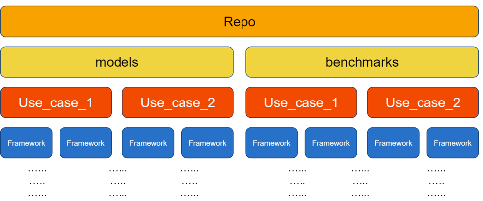

# Model Zoo for Intel® Architecture

This repository contains **links to pre-trained models, sample scripts, best practices, and step-by-step tutorials** for many popular open-source machine learning models optimized by Intel to run on Intel® Xeon® Scalable processors. 

Model packages and containers for running the Model Zoo's workloads can be found at the [Intel® oneContainer Portal](https://software.intel.com/containers).

## Purpose of the Model Zoo

  - Demonstrate the AI workloads and deep learning models Intel has optimized and validated to run on Intel hardware
  - Show how to efficiently execute, train, and deploy Intel-optimized models
  - Make it easy to get started running Intel-optimized models on Intel hardware in the cloud or on bare metal

***DISCLAIMER: These scripts are not intended for benchmarking Intel platforms. 
For any performance and/or benchmarking information on specific Intel platforms, visit [https://www.intel.ai/blog](https://www.intel.ai/blog).***

## How to Use the Model Zoo

### Getting Started using AI Kit
- The Intel Model Zoo is released as a part of the [Intel® AI Analytics Toolkit](https://software.intel.com/content/www/us/en/develop/tools/oneapi/ai-analytics-toolkit.html)
  which provides a consolidated package of Intel’s latest deep and machine learning optimizations
  all in one place for ease of development. Along with Model Zoo, the toolkit also includes Intel
  optimized versions of deep learning frameworks (TensorFlow, PyTorch) and high performing Python
  libraries to streamline end-to-end data science and AI workflows on Intel architectures.
- The [documentation here](/docs/general/tensorflow/AIKit.md) has instructions on how to get to
  the Model Zoo's conda environments and code directory within AI Kit.
- There is a table of TensorFlow models with links to instructions on how to run the models [here](/benchmarks/README.md).
- To get started you can refer to the [ResNet50 FP32 Inference code sample.](https://github.com/oneapi-src/oneAPI-samples/tree/master/AI-and-Analytics/Features-and-Functionality/IntelTensorFlow_ModelZoo_Inference_with_FP32_Int8)

### Getting Started without AI Kit
- If you know what model you are interested in, or if you want to see a full list of models in the Model Zoo, start **[here](/benchmarks)**.
- For framework best practice guides, and step-by-step tutorials for some models in the Model Zoo, start **[here](/docs)**.

### Directory Structure
The Model Zoo is divided into four main directories:
- **[benchmarks](/benchmarks)**: Look here for sample scripts and complete instructions on downloading and running each Intel-optimized pre-trained model.
- **[docs](/docs)**: General best practices and detailed tutorials for a selection of models and frameworks can be found in this part of the repo. 
- **[models](/models)**: This directory contains optimized model code that has not yet been upstreamed to its respective official repository, such as dataset processing routines. 
  There are no user-friendly READMEs in this directory, but many supporting modules are here.
- **[tests](/tests)**: Look here for unit tests and information on how to run them. 

The benchmarks, models, and docs folders share a common structure. Each model (or document) is organized first by *use case* and then by *framework*. 
Inside the model-specific directory, there may be further nesting subdirectories for inference vs. training and FP32 vs. Int8 precision. 
We hope this structure is intuitive and helps you find what you are looking for; when in doubt, consult the section's main README. 

## How to Contribute
If you would like to add a new benchmarking script, please use [this guide](/Contribute.md).
