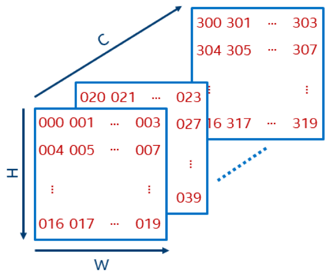

# General Best Practices for Intel® Optimization of TensorFlow Serving

## Introduction

The Intel® Optimization of TensorFlow Serving leverages Intel® oneAPI Deep Neural Network Library (Intel® oneDNN) to perform inferencing tasks significantly faster than the default installation on Intel® processors.
To install Intel Optimization of TensorFlow Serving, please refer to the [TensorFlow Serving Installation Guide](InstallationGuide.md).
Here we provide a brief description of the available TensorFlow model server settings and some general best practices for optimal performance.
Due to potential differences in environment, memory, network, model topology, and other factors,
we recommend that you explore a variety of settings and hand-tune TensorFlow Serving for your particular workload and metric of interest,
but the following information will help you get started.

## Performance Metrics

* **Batch Inference** measures how many input tensors can be processed per second with batches of size greater than one.
Typically for batch inference, optimal performance is achieved by exercising all the physical cores on a socket.
* **Online Inference** (also called real-time inference) is a measurement of the time it takes to process a single input tensor, i.e. a batch of size one.
In a real-time inference scenario, optimal performance is achieved by minimizing thread launching and orchestration between concurrent processes.
This guide will help you set your TensorFlow model server options for good balanced performance over both metrics.
However, if you want to prioritize one metric over the other or further tune TensorFlow Serving for your specific model, see the [tutorials](/docs#tutorials-by-use-case).

## TensorFlow Serving Configuration Settings

There are six parameters you can set when running the TensorFlow Serving with Intel oneDNN docker container.
* ***OMP_NUM_THREADS*** is the maximum number of threads available. A good guideline is to set it equal to the number of physical cores.
* ***TENSORFLOW_INTER_OP_PARALLELISM*** is the number of thread pools to use for a TensorFlow session. A good guideline we have found empirically is to set this to 2 (you may want to start with this suggestion but then try other values, as well).
* ***TENSORFLOW_INTRA_OP_PARALLELISM*** is the number of threads in each thread pool to use for a TensorFlow session. A good guideline is to set it equal to the number of physical cores. 
The number of physical cores (referred to from now on as *num_physical_cores*) may be different from the number of logical cores or CPUs and can be found in Linux with the `lscpu` command.
* ***KMP_BLOCKTIME*** is the time, in milliseconds, that a thread should wait after completing the execution of a parallel region, before sleeping.
A small value may offer better overall performance if the application contains non-OpenMP threaded code. A larger value may be more appropriate if threads are to be reserved solely for use for OpenMP execution. 
As a starting point, it is suggested to set this to 0 for CNN models and 1 for non-CNN topologies. The default is 1. 
* ***KMP_AFFINITY*** controls how threads are distributed and ultimately bound to specific processing units. 
A value of `granularity=fine,verbose,compact,1,0` is recommended when hyperthreading is enabled (this is the default), and `granularity=fine,verbose,compact` is recommended when hyperthreading is disabled.
* ***KMP_SETTINGS*** enables or disables the printing of OpenMP run-time library environment variables during program execution. The default is 1. 

## Docker CPUSET Settings

We recommend pinning a TensorFlow Serving container to a single NUMA node. Use the Docker run options `--cpuset-cpus` and `--cpuset-mems`. 
The output of the `lscpu` command will show the CPU IDs associated with each NUMA node.
* ***--cpuset-cpus/--cpuset-mems*** to confine the container to use a single NUMA node. For the equivalent of `numactl --cpunodebind=0 --membind=0`, use `docker run ... --cpuset-cpus="<cpus_in_numa_node_0>" --cpuset-mems=0 ...` for NUMA node 0.
* ***Concurrent Model Servers*** You can fully exercise your hardware by launching multiple model servers, each bound to a different NUMA node and served via a different port. 
  To do this, you may want to use a different machine to send the client requests using the *&* command to launch non-blocking executions in the shell: *python client_script.py --server xyz.com:8500 & python client_script.py --server xyz.com:8501*

### Example

To determine the number of physical cores and the NUMA node CPU IDs, execute the `lscpu` command.
We will walk through an example for a machine with this `lscpu` output:

```
Architecture:        x86_64
CPU op-mode(s):      32-bit, 64-bit
Byte Order:          Little Endian
CPU(s):              112
On-line CPU(s) list: 0-111
Thread(s) per core:  2
Core(s) per socket:  28
Socket(s):           2
NUMA node(s):        2
Vendor ID:           GenuineIntel
CPU family:          6
Model:               85
Model name:          Intel(R) Xeon(R) Platinum 8180 CPU @ 2.50GHz
Stepping:            4
CPU MHz:             1000.661
CPU max MHz:         3800.0000
CPU min MHz:         1000.0000
BogoMIPS:            5000.00
Virtualization:      VT-x
L1d cache:           32K
L1i cache:           32K
L2 cache:            1024K
L3 cache:            39424K
NUMA node0 CPU(s):   0-27,56-83
NUMA node1 CPU(s):   28-55,84-111
Flags:               fpu vme de...
```
The NUMA node lines toward the end show the socket 0 and socket 1 CPU IDs. We then compute:
* For a container on all sockets: *num_physical_cores* = `Core(s) per socket` * `Socket(s)` = 28 * 2 = 56
* For a container pinned to one socket: *num_physical_cores* = `Core(s) per socket` = 28

Next, compute ***OMP_NUM_THREADS***, ***TENSORFLOW_INTER_OP_PARALLELISM***, and ***TENSORFLOW_INTRA_OP_PARALLELISM***:
* For a container on all sockets:
  * ***OMP_NUM_THREADS*** = *num_physical_cores* = 56
  * ***TENSORFLOW_INTER_OP_PARALLELISM*** = 2
  * ***TENSORFLOW_INTRA_OP_PARALLELISM*** = *num_physical_cores* = 56
* For a container pinned to one socket:
  * ***OMP_NUM_THREADS*** = *num_physical_cores* = 28
  * ***TENSORFLOW_INTER_OP_PARALLELISM*** = 2
  * ***TENSORFLOW_INTRA_OP_PARALLELISM*** = *num_physical_cores* = 28
  
Then start the model server container from the TensorFlow Serving docker image with a command that sets the environment variables to these values
(this assumes some familiarity with docker and the `docker run` command). 

For a container on all sockets (this is an example, use your computed `num_physical_cores` in place of `56`):
```
docker run \
    --name=tfserving \
    --rm \
    -d \
    -p 8500:8500 \
    -v "/home/<user>/<saved_model_directory>:/models/<model_name>" \
    -e MODEL_NAME=<model_name> \
    -e OMP_NUM_THREADS=56 \
    -e TENSORFLOW_INTER_OP_PARALLELISM=2 \
    -e TENSORFLOW_INTRA_OP_PARALLELISM=56 \
    intel/intel-optimized-tensorflow-serving:2.3.0
```

For two containers, each on a single socket (this is an example, use your computed `num_physical_cores` in place of `28` and your NUMA node CPU ID ranges from the output of `lscpu`):
```
docker run \
    --name=tfserving \
    --rm \
    -d \
    -p 8500:8500 \
    -v "/home/<user>/<saved_model_directory>:/models/<model_name>" \
    -e MODEL_NAME=<model_name> \
    -e OMP_NUM_THREADS=28 \
    -e TENSORFLOW_INTER_OP_PARALLELISM=2 \
    -e TENSORFLOW_INTRA_OP_PARALLELISM=28 \
    --cpuset-cpus="0-27,56-83" \ 
    --cpuset-mems="0" \ 
    intel/intel-optimized-tensorflow-serving:2.3.0

docker run \
    --name=tfserving \
    --rm \
    -d \
    -p 8501:8500 \
    -v "/home/<user>/<saved_model_directory>:/models/<model_name>" \
    -e MODEL_NAME=<model_name> \
    -e OMP_NUM_THREADS=28 \
    -e TENSORFLOW_INTER_OP_PARALLELISM=2 \
    -e TENSORFLOW_INTRA_OP_PARALLELISM=28 \
    --cpuset-cpus="28-55,84-111" \ 
    --cpuset-mems="1" \ 
    intel/intel-optimized-tensorflow-serving:2.3.0
```

To customize other settings, just use the relevant environment variables when running the TensorFlow Serving container: 
* `-e KMP_BLOCKTIME=0`
* `-e KMP_AFFINITY=granularity=fine,verbose,compact`
* `-e KMP_SETTINGS=0`

## gRPC vs. REST

It has been suggested (e.g. [here](https://medium.com/@avidaneran/tensorflow-serving-rest-vs-grpc-e8cef9d4ff62) and [here](https://medium.com/@EmperorRXF/evaluating-performance-of-rest-vs-grpc-1b8bdf0b22da)) that gRPC has faster client-side serialization and de-serialization than REST, due to its use of protocol buffers.
For this reason, it is usually faster for batch inference. We recommend using gRPC for optimal overall performance, but your choice should depend on your particular model topology, data characteristics, and the workloads you expect. There may be cases where REST is preferable.

## Data Format

Data format can play an important role in inference performance. For example, the multi-dimensional image data inputs for image recognition and object detection models can be stored differently in memory address space.
Image data format can be represented by 4 letters for a 2-dimensional image - N: number of images in a batch, C: number of channels in an image, W: width of an image in pixels, and H: height of an image in pixels.
The order of the four letters indicates how pixel data are stored in 1-dimensional memory space, with the outer-most dimension first and the inner-most dimension last.
Therefore, NCHW indicates pixel data are stored first width-wise (the inner-most dimension), followed by height, then channel, and finally batch (Figure 1).
TensorFlow supports both NCHW and NHWC data formats. While NHWC is the default format, NCHW is more efficient for Intel Optimization of TensorFlow Serving with Intel oneDNN and is the recommended layout for image data.



Figure 1. NCHW format

## Summary of General Best Practices

1. Find *num_physical_cores* by using the `lscpu` command and multiplying `Core(s) per socket` by `Socket(s)` or using `Core(s) per socket` for single-socket
2. Run the TensorFlow model server docker container with:
    - ***OMP_NUM_THREADS*** = *num_physical_cores*
    - ***TENSORFLOW_INTER_OP_PARALLELISM*** = 2
    - ***TENSORFLOW_INTRA_OP_PARALLELISM*** = *num_physical_cores*
3. For a system with multiple NUMA nodes, run a separate TensorFlow Serving container on each node by using `--cpuset-cpus=<cpu_ids>` and `--cpuset-mems=<socket_id>`, with values taken from the output of `lscpu`
4. Use the gRPC protocol for best overall performance
5. Use NCHW data format for images
6. See one of the hands-on [tutorials](/docs/README.md) for an advanced walkthrough of your use case
