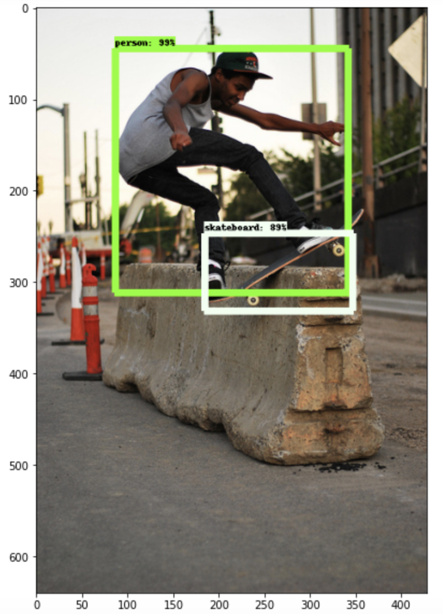

# Object Detection with TensorFlow Serving on CPU
Models: R-FCN and SSD-MobileNet

## Goal

This tutorial will introduce you to the CPU performance considerations for object detection in deep learning models and how to use [Intel® Optimizations for TensorFlow Serving](https://www.tensorflow.org/tfx/guide/serving) to improve inference time on CPUs. 
This tutorial uses two pre-trained models - a [Region-based Fully Convolutional Network (R-FCN)](https://arxiv.org/pdf/1605.06409.pdf) and a [Single-Shot MultiBox Detector MobileNet (SSD-MobileNet)](https://arxiv.org/pdf/1704.04861.pdf) - for object detection and provides sample code that you can use to get your optimized TensorFlow model server and client up and running quickly.
In this tutorial you will choose between R-FCN and SSD-MobileNet, and between the REST client and gRPC client, and then measure inference performance in two situations:
* **Online inference**, where batch_size=1. In this case, a lower number means better runtime performance.
* **Batch inference**, where batch_size>1. In this case, a higher number means better runtime performance.

## Prerequisites

This tutorial assumes you have already:
* [Installed TensorFlow Serving](/docs/general/tensorflow_serving/InstallationGuide.md)
* Read and understood the [General Best Practices](/docs/general/tensorflow_serving/GeneralBestPractices.md),
  especially these sections:
  * [Performance Metrics](/docs/general/tensorflow_serving/GeneralBestPractices.md#performance-metrics)
  * [TensorFlow Serving Configuration Settings](/docs/general/tensorflow_serving/GeneralBestPractices.md#tensorflow-serving-configuration-settings)
* Ran an example end-to-end using a REST or gRPC client, such as the examples in the [Installation Guide](/docs/general/tensorflow_serving/InstallationGuide.md#example-serving-resnet-50-v1-model)
  
> Note: We show both gRPC and REST protocols in this tutorial.

## Background

[Intel® oneAPI Deep Neural Network Library (Intel® oneDNN)](https://github.com/oneapi-src/oneDNN) offers significant performance improvements for convolution, pooling, normalization, activation, and other operations for object detection, using efficient vectorization and multi-threading.
Tuning TensorFlow Serving to take full advantage of your hardware for object detection deep learning inference involves:
1. Running a TensorFlow Serving docker container configured for performance given your hardware resources
2. Running a REST or gRPC client to verify object detection and measure online and batch inference
3. Experimenting with the TensorFlow Serving settings on your own to further optimize for your model and use case

## Hands-on Tutorial

1. **Download the data and clone the Model Zoo**: 

   1.1 Download the 2017 validation COCO dataset (~780MB) (**note**: do not convert the COCO dataset to TF records format):
   
   ```
   cd ~
   mkdir -p coco/val
   wget http://images.cocodataset.org/zips/val2017.zip
   unzip val2017.zip -d coco/val
   export COCO_VAL_DATA=$(pwd)/coco/val/val2017
   echo "export COCO_VAL_DATA=$(pwd)/coco/val/val2017" >> ~/.bashrc
   ```
   
   1.2 Clone the Intel Model Zoo into your home directory:
   
   ```
   cd ~
   git clone https://github.com/IntelAI/models.git
   ```
  
2. **Choose your model and download the pre-trained SavedModel**: Select either R-FCN or SSD-MobileNet. 
   Then download and extract the pre-trained model and copy the `saved_model.pb` to `~/obj_detection/1` (the `1` subdirectory is important - don't skip it!).
   This is the file we will serve from TensorFlow Serving. Finally, define a variable for your chosen model to use in later steps.
   Refer to the [TensorFlow documentation](https://github.com/tensorflow/tensorflow/tree/master/tensorflow/python/saved_model) for more information about SavedModels, and refer to the FP32 model READMEs for [R-FCN](/benchmarks/object_detection/tensorflow/rfcn/README.md#fp32-inference-instructions) and [SSD-MobileNet](/benchmarks/object_detection/tensorflow/ssd-mobilenet/README.md#fp32-inference-instructions) to get the latest location of the pre-trained models.
   
   Highlight and copy one of the following download links:
   * R-FCN: `https://storage.googleapis.com/intel-optimized-tensorflow/models/v1_8/rfcn_resnet101_fp32_coco_pretrained_model.tar.gz`
   * SSD-MobileNet: `http://download.tensorflow.org/models/object_detection/ssd_mobilenet_v1_coco_2018_01_28.tar.gz`
   
   Then execute the following bash commands after customizing them for the model you have chosen:
   
   ```
   cd ~
   wget <paste the download link here>
   tar -xzvf <paste the downloaded file name here>
   mkdir -p obj_detection/1
   cp <paste the model folder name here>/saved_model/saved_model.pb obj_detection/1
   model_name=<choose rfcn or ssd-mobilenet>
   ```

3. **Set up your virtual environment**: We will use a virtual environment to install the required packages.

   3.1 If you do not have pip or virtualenv, you will need to get them first:
   ```
   sudo apt-get install -y python python-pip virtualenv
   ```
		
   3.2 Create and activate the python virtual environment in your home directory:
   ```
   cd ~
   virtualenv -p python3 od_venv
   source od_venv/bin/activate
   ```
   
   3.3 Install the required packages using `requirements.txt`:
   ```
   pip install -r models/benchmarks/object_detection/tensorflow_serving/ssd-mobilenet/inference/fp32/requirements.txt
   ```
   
   3.3 Choose between the REST example or the gRPC example (the environment dependencies are different depending on the protocol you use, 
   and gRPC is usually faster, especially when using larger batch sizes). Define a variable for your desired protocol.
   
     **REST**:
     ```
     protocol_name=rest
     ```
     
     **gRPC**:
     ```
     protocol_name=grpc
     ```
     
4. **Install [TensorFlow Object Detection API](https://github.com/tensorflow/models/tree/master/research/object_detection)**:
   For detailed instructions, go to the installation page for [TensorFlow 1](https://github.com/tensorflow/models/blob/master/research/object_detection/g3doc/tf1.md) or [TensorFlow 2](https://github.com/tensorflow/models/blob/master/research/object_detection/g3doc/tf2.md). 
   We have already installed the required python packages for the API. Following are the rest of the instructions for Ubuntu 18.04.

   4.1 Clone the tensorflow models repo into a new folder in your home directory.
   ```
   cd ~
   git clone https://github.com/tensorflow/models tensorflow-models
   export TF_MODELS_ROOT=$(pwd)/tensorflow-models
   echo "export TF_MODELS_ROOT=$(pwd)/tensorflow-models" >> ~/.bashrc
   ```

   4.2 Manually install the protobuf-compiler v3.0.0, run the compilation process, and add libraries to PYTHONPATH and to your `.bashrc`.
   ```
   cd $TF_MODELS_ROOT/research/
   wget -O protobuf.zip https://github.com/protocolbuffers/protobuf/releases/download/v3.0.0/protoc-3.0.0-linux-x86_64.zip
   unzip protobuf.zip
   ./bin/protoc object_detection/protos/*.proto --python_out=.
   export PYTHONPATH=$PYTHONPATH:$(pwd):$(pwd)/slim
   echo "export PYTHONPATH=$PYTHONPATH:$(pwd):$(pwd)/slim" >> ~/.bashrc
   ```
 
5. **Discover the number of physical cores**: Compute *num_physical_cores* by executing the `lscpu` command and multiplying `Core(s) per socket` by `Socket(s)`. 
   For example, for a machine with `Core(s) per socket: 28` and `Socket(s): 2`, `num_physical_cores = 28 * 2 = 56`. 
   To compute *num_physical_cores* with bash commands:
   ```
   cores_per_socket=`lscpu | grep "Core(s) per socket" | cut -d':' -f2 | xargs`
   num_sockets=`lscpu | grep "Socket(s)" | cut -d':' -f2 | xargs`
   num_physical_cores=$((cores_per_socket * num_sockets))
   echo $num_physical_cores
   ```

6. **Start the server**: Now start up the TensorFlow model server. Using `-d` (for "detached") runs the container as a background process. 
   We will publish the ports for both REST (`-p 8501:8501`) and gRPC (`-p 8500:8500`).
   To optimize overall performance, use the following recommended settings from the [General Best Practices](/docs/general/tensorflow_serving/GeneralBestPractices.md):
   * OMP_NUM_THREADS=*num_physical_cores*
   * TENSORFLOW_INTER_OP_PARALLELISM=2
   * TENSORFLOW_INTRA_OP_PARALLELISM=*num_physical_cores*
 
   ```
   cd ~
   docker run \
       --name=tfserving \
       -d \
       -p 8500:8500 \
       -p 8501:8501 \
       -v "$(pwd)/obj_detection:/models/$model_name" \
       -e MODEL_NAME=$model_name \
       -e OMP_NUM_THREADS=$num_physical_cores \
       -e TENSORFLOW_INTER_OP_PARALLELISM=2 \
       -e TENSORFLOW_INTRA_OP_PARALLELISM=$num_physical_cores \
       intel/intel-optimized-tensorflow-serving:2.3.0
   ```
   
   **Notes**: 
   1. For some models, playing around with the parallelism settings can improve performance even further. 
      We recommend that you experiment with your own hardware and model if you have strict performance requirements.
   2. After running some basic tests, you may wish to constrain the inference server to a single socket. 
      Docker has many runtime flags that allow you to control the container's access to the host system's CPUs, memory, and other resources.
      * See our [Best Practices document](/docs/general/tensorflow_serving/GeneralBestPractices.md#docker-cpuset-settings) for information and examples
      * See the [Docker document on this topic](https://docs.docker.com/config/containers/resource_constraints/#cpu) for more options and definitions
   
7. **Measure online inference performance**: Run the `object_detection_benchmark.py` [python script](/benchmarks/object_detection/tensorflow_serving/ssd-mobilenet/inference/fp32/object_detection_benchmark.py), which can test both online and batch inference performance. 
   
   Online Inference:
   ```
   cd ~
   python models/benchmarks/object_detection/tensorflow_serving/ssd-mobilenet/inference/fp32/object_detection_benchmark.py \
       -i $COCO_VAL_DATA \
       -m $model_name \
       -p $protocol_name \
       -b 1
   ```
   
   Batch Inference:
   ```
   cd ~
   python models/benchmarks/object_detection/tensorflow_serving/ssd-mobilenet/inference/fp32/object_detection_benchmark.py \
       -i $COCO_VAL_DATA \
       -m $model_name \
       -p $protocol_name \
       -b 128
   ```

8. **Visualize object detection output**: To visually see the results of object detection, we will use a Jupyter notebook via web browser. 
   If you are using a system that does not have a browser, such as a VM on GCP or AWS, a workaround is to use local port forwarding of port 8888 to relay the jupyter service to your localhost.
   You will need to quit your SSH session and log back in with port forwarding configured. For example, with a GCP VM, add `--ssh-flag="-L 8888:localhost:8888"` to your ssh command. 
   Once you are connected again with port forwarding, reactivate the virtual environment, navigate to the `docs/notebooks` directory, and start the jupyter notebook service.
   
   ```
   cd ~
   source od_venv/bin/activate
   cd models/docs/notebooks
   jupyter notebook
   ```
   
   After running `jupyter notebook`, paste the generated link into your browser and open the `ObjectDetection.ipynb` file. 
   You will need to edit the code in one cell - in the second code cell, set the names of your chosen model and protocol.
   Then, execute the cells in order. The output of the "Test Object Detection" section should be an image with objects detected by the served model.
   
   
   
9. **Clean up**: 
    * After saving any changes you made to the Jupyter notebook, close the file and stop the Jupyter server by clicking `Quit` from the main file browser. 
    * After you are finished with querying, you can stop the container which is running in the background. 
    To restart the container with the same name, you need to stop and remove the container from the registry. 
    To view your running containers run `docker ps`.
    
	```
	docker rm -f tfserving
	```
    
    * Deactivate your virtual environment with `deactivate`.
    
## Conclusion
You have now seen an end-to-end example of serving an object detection model for inference using TensorFlow Serving, and learned:
1. How to choose good values for the performance-related runtime parameters exposed by the `docker run` command
2. How to test online and batch inference metrics using a REST or gRPC client
3. How to verify that the served model can correctly detect objects in an image using a sample Jupyter notebook

With this knowledge and the example code provided, you should be able to get started serving your own custom object detection model with good performance. 
If desired, you should also be able to investigate a variety of different settings combinations to see if further performance improvement are possible.
