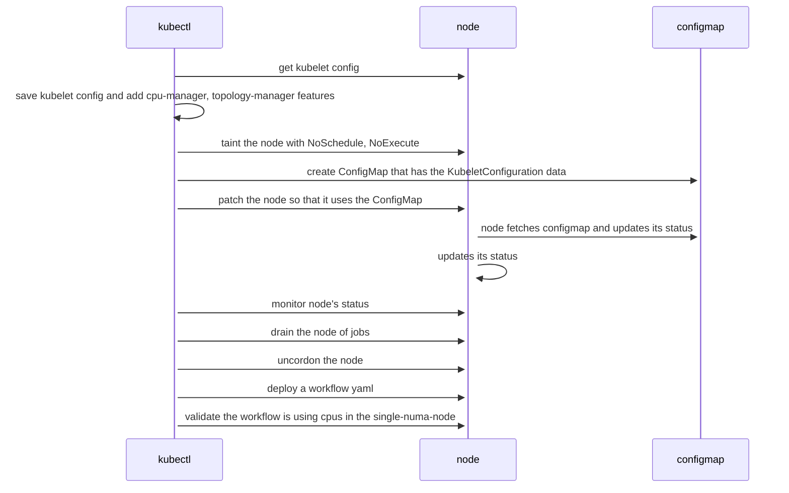

# Kubernetes Dev Ops

## MPI Operator Deployment

The following instructions explain how to deploy the [MPI Operator](https://github.com/kubeflow/mpi-operator/)
to a Kubernetes cluster. This deployment needs to be done by a devops user with Cluster RBAC permissions.

We have a [copy of the `mpi-operator.yaml`](/tools/k8s/devops/operators/mpi-operator/mpi-operator.yaml)
that is compatible with our multi-node Kubernetes packages. There are instructions on how to deploy this
mpi-operator in this [README](/tools/k8s/devops/operators/mpi-operator/README.md).

If you prefer to install it from the [MPI Operator repo](https://github.com/kubeflow/mpi-operator/),
follow the steps below that explain how to deploy the mpi-operator on your cluster using version `v0.2.3`.

1. Download the v1alpha2 `mpi-operator.yaml` file from the v0.2.3 tag
   ```
   curl -o mpi-operator.yaml https://raw.githubusercontent.com/kubeflow/mpi-operator/v0.2.3/deploy/v1alpha2/mpi-operator.yaml
   ```

2. Change line #189 from `image: mpioperator/mpi-operator:latest` to `image: mpioperator/mpi-operator:v0.2.3`

3. Deploy the operator
   ```
   kubectl apply -f mpi-operator.yaml
   ```

For more information on deploying the mpi-operator to the k8s cluster, see the
[documentation in the mpi-operator repo](https://github.com/kubeflow/mpi-operator#mpi-operator).

## Argo Deployment

Prior to running Argo workflows, the controller needs to be deployed on
the cluster. See [Argo's Quick Start Guide](https://github.com/argoproj/argo-workflows/blob/stable/docs/quick-start.md)
for installation instructions.

Running the [hello world workflow](https://github.com/argoproj/argo-workflows/blob/stable/docs/quick-start.md)
and verifying that it succeeds is a good test to verify that the argo
installation is working. Using the Argo CLI is optional. The argo yaml
can be deployed using `kubectl create`.

## Enabling CPU Pinning in model workflows

Models running single or multi-node workflows on kubernetes-v1.18+ can claim exclusive use of cpus within a single numa node by 
leveraging the _native_ kubernetes [Topology Manager](https://kubernetes.io/docs/tasks/administer-cluster/topology-manager/). 
More sophisticated cpu policies may be enabled by installing the [CRI Resource Manager](https://intel.github.io/cri-resource-manager/stable/docs/index.html).
This additional capability will not be discussed here, rather just the native kubernetes cpu-pinning - available in k8-v1.18 (beta).

CPU Pinning on a kubernetes node is done by:

1. Enabling the __Topology Manager__ on one or more nodes within a cluster.
2. Specifying a Qos class of [Guaranteed](https://kubernetes.io/docs/tasks/configure-pod-container/quality-service-pod/#create-a-pod-that-gets-assigned-a-qos-class-of-guaranteed) within the workflow yaml. An example of a yaml file that specifies a Pod with a Guaranteed Qos class is shown below:

```
apiVersion: v1
kind: Pod
metadata:
  name: cpu-pinning-test
spec:
  containers:
  - name: cpu-pinning-test
    image: bash
    resources:
      limits:
        memory: "100M"
        cpu: "2"
      requests:
        memory: "100M"
        cpu: "2"
    command: 
    - sleep
    args:
    - infinity
    imagePullPolicy: IfNotPresent
```

### Enabling the Topology Manager on a kubernetes node

In order to use the topology manager, the kubernetes node must be running a kubelet with the startup argument [--dynamic-config-dir](https://kubernetes.io/docs/tasks/administer-cluster/reconfigure-kubelet/#before-you-begin). This startup option allows the node's kubelet to be configured dynamically using a ConfigMap. Modifying a kubelet may disrupt existing pods running on that node, so operations that enable a node's cpu pinning should include cordoning the node and adding scheduling constraints. This sequence of operations is shown below. The operation sequence is then implemented within a bash script[^✝], annotated to match each operation step. 

[^✝]: the bash script assumes [kubectl-v1.19+](https://github.com/kubernetes/kubectl/releases) and [yq-v3.4.1](https://github.com/mikefarah/yq/releases/tag/3.4.1) are installed.
1. Get the node's kubelet configuration and add cpu-manager, topology-manager features
2. Taint the node with [NoSchedule](https://kubernetes.io/docs/concepts/scheduling-eviction/taint-and-toleration/#example-use-cases) and [NoExecute](https://kubernetes.io/docs/concepts/scheduling-eviction/taint-and-toleration/#taint-based-evictions).
3. Create a ConfigMap in the kube-system namespace that has the KubeletConfiguration data.
4. Patch the node so that it uses the ConfigMap.
5. Monitor the node to validate it has recognized and is using the ConfigMap.
6. [Drain](https://kubernetes.io/docs/reference/generated/kubectl/kubectl-commands#drain) the node of pods that aren't critical.
7. Uncordon the node.
8. Deploy a workflow yaml.
9. Validate the workflow is using reserved cpu's within a single numa node.

#### sequence diagram of operations



#### bash script: enable-cpu-pinning.sh

```bash
#
# calls enable-cpu-pinning with a node name
#
if [[ "${BASH_SOURCE[0]}" == "${0}" ]]; then
  node.enable-cpu-pinning $@
fi
```

#### bash function: _get-kubelet-config_

```bash
#
# get the node's kubelet configuration
# Reference: [Generate the configuration file](https://kubernetes.io/docs/tasks/administer-cluster/reconfigure-kubelet/#generate-the-configuration-file)
#
# Note: add to bash script enable-cpu-pinning.sh
#
node.get-kubelet-config()
{
  local _node _proxy_pid _tmp_file1
  if (( $# != 1 )); then
    echo 'usage: '${FUNCNAME[0]##*.}' <node>' >&2
    return
  fi
  _node=$!
  kubectl proxy --port=8001 &
  _proxy_pid=$!
  _tmp_file1=$(mktemp /tmp/node.kubelet-config-override.XXXXXXX)
  cat > $_tmp_file1 <<KUBELET_OVERRIDES
kind: KubeletConfiguration
apiVersion: kubelet.config.k8s.io/v1beta1
cpuManagerPolicy: static
topologyManagerPolicy: single-numa-node
topologyManagerScope: pod
featureGates:
  CPUManager: true
  TopologyManager: true
kubeReserved:
  cpu: "1"
systemReserved:
  cpu: "1"
KUBELET_OVERRIDES
  curl -sSL "http://localhost:8001/api/v1/nodes/node2/proxy/configz" | yq r - kubeletconfig --prettyPrint | yq m -x - $_tmp_file1 > /tmp/kubelet_configz.yaml
  kill $_proxy_pid 2>&1 >/dev/null
  rm -f $_tmp_file1
}
```

#### bash function: _get-status-config_

```bash
#
# polls the node until it updates its status.config
#
# Note: add to bash script enable-cpu-pinning.sh
#
node.get-status-config()
{
  local _node _output
  if (( $# != 1 )); then
    echo 'usage: '${FUNCNAME[0]##*.}' <node>' >&2
    return
  fi
  _node=$1
  _output='{}'
  while (( ${#_output} == 2 )); do
    sleep 2
    echo 'Waiting for '$_node' to update status.config'
    _output=$(kubectl get node $_node -oyaml | yq r - status.config)
  done
  kubectl get node $_node -oyaml | yq r - status.config
}
```

#### bash function: _enable-cpu-pinning_

```bash
#
# gets a node's kubelet config
# adds topology-manager=single-numa-node, cpu-manager=static
# creates a configmap
# patches the node's to use the configmap
#
# Note: add to bash script enable-cpu-pinning.sh
#
node.enable-cpu-pinning()
{
  local _node_cm _node _patch
  if (( $# != 1 )); then
    echo 'usage: '${FUNCNAME[0]##*.}' <node>' >&2
    return
  fi
  _node=$1
  _node_cm=$(kubectl -n kube-system get cm -oname | grep ${_node}-config)
  _node_cm=${_node_cm#configmap/}
  if [[ -n $_node_cm ]]; then
    kubectl -n kube-system delete cm $_node_cm
  fi
  rm -f /tmp/kubelet_configz.yaml
  node.get-kubelet-config $_node
  #Step 1.
  kubectl taint nodes $_node dedicated=cpu-pinning:NoSchedule
  kubectl taint nodes $_node dedicated=cpu-pinning:NoExecute
  #Step 2.
  kubectl -n kube-system create configmap ${_node}-config --from-file=kubelet=/tmp/kubelet_configz.yaml --append-hash
  _node_cm=$(kubectl -n kube-system get cm -oname | grep ${_node}-config)
  _node_cm=${_node_cm#configmap/}
  _patch=$'{"spec":{"configSource":{"configMap":{"name":"'$_node_cm$'","namespace":"kube-system","kubeletConfigKey":"kubelet"}}}}'
  #Step 3.
  kubectl patch node $_node -p "$_patch"
  #Step 4.
  node.get-status-config $_node
  #Step 5.
  kubectl drain $_node --ignore-daemonsets &&
  #Step 6.
  kubectl uncordon $_node
}
```
